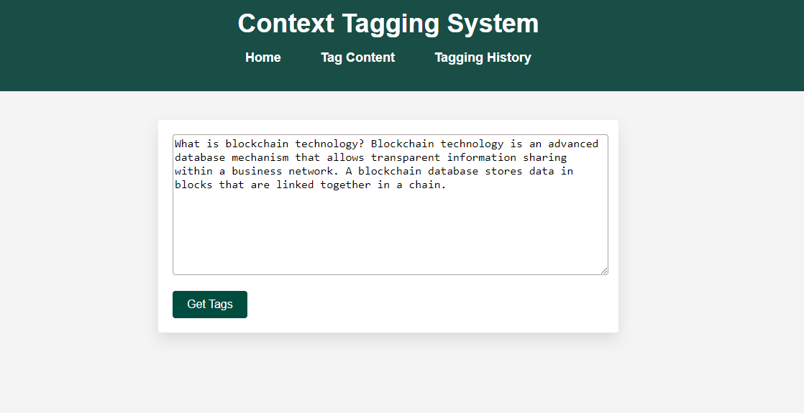

## Contextual Tagging System

# Description

The Contextual Tagging System is a powerful NLP project designed to categorize text content into specific topics. Utilizing a tokenizer from a pretrained model and transformers from Hugging Face, the system accurately tags text based on its context, assigning it to one of the predefined topics. This makes it an ideal tool for organizing and categorizing large volumes of text data.

# Installation
1. Clone the repository:
   ```bash
       git clone https://github.com/yourusername/contextual-tagging-system.git
   ```

2. Navigate to the project directory:
   ```bash
        cd contextual_tagging
   ```
3. Create a virtual environment and activate it:
    ```bash
        python -m venv env
        source env/bin/activate  # On Windows use `env\Scripts\activate`
   ```
4. Install the required dependencies:
   ```bash
        pip install -r requirements.txt
   ```
        

    # Usage 
    ```bash
        python manage.py runserver
   ```
    



    
